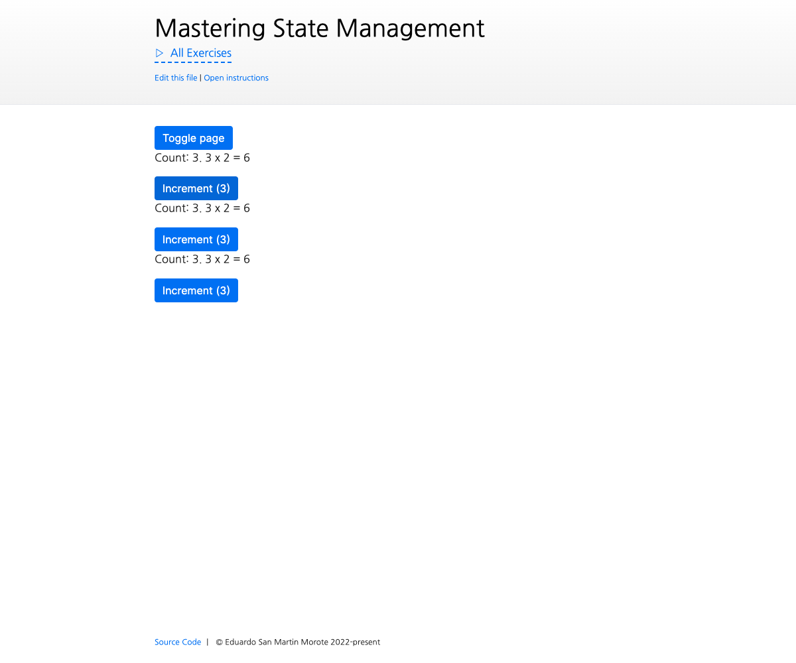

# Title

<picture>
  <source srcset="./.internal/screenshot-dark.png" media="(prefers-color-scheme: dark)">
  
</picture>

short description

## 📝 Your Notes

Write your notes or questions here.

## 🎯 Goals

- Display the deck list
  - fetch with store
  - handle SSR
  - refresh on mount
- Deck creation
  - Create the page that handles the creation
  - Create the method in the decks store
  - redirect to page after creation
  - Display errors

## 💪 Extra goals

_Extra goals might not have any tests and can be done later or skipped._

- If a deck is not found, an ongoing review should be cancelled

TODO:

- notes about upgrade with idb and that if they change the schema, they should update the version number and handle the
  migration themselves. Could have used something like https://orm.drizzle.team/docs/get-started-postgresql#pglite but
  not worth adding more complexity
