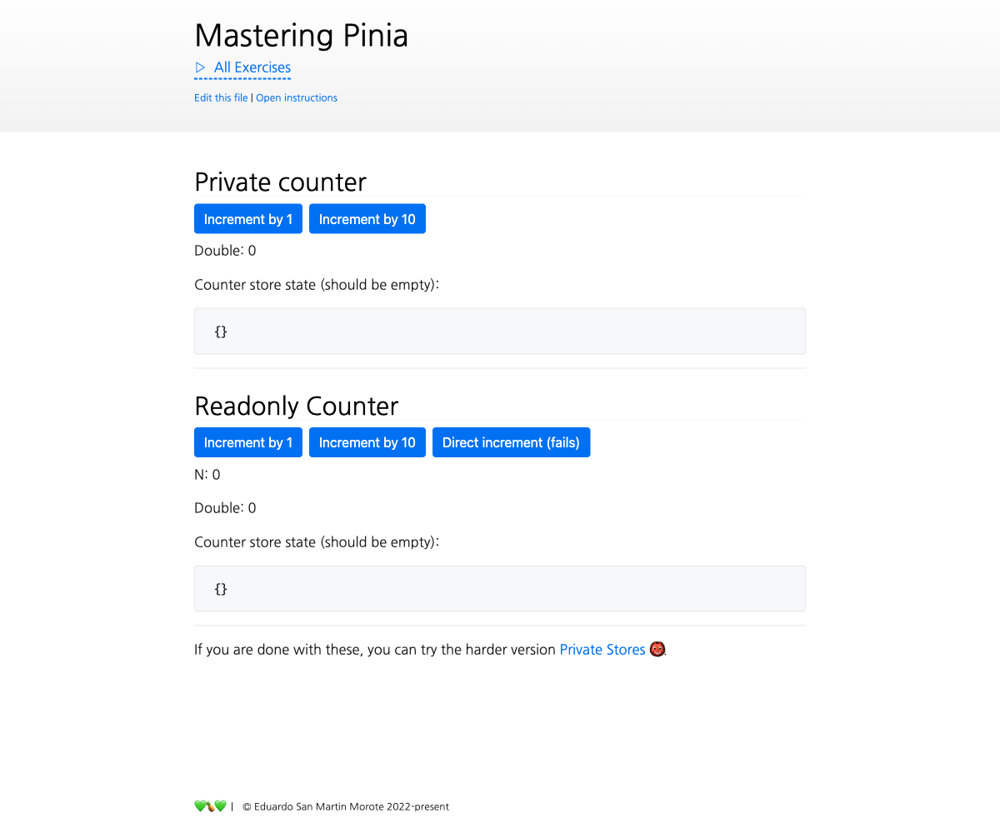

# Private state in Stores

<picture>
  <source srcset="./.internal/screenshot-dark.png" media="(prefers-color-scheme: dark)">
  
</picture>

Defining private state through extra stores is not too verbose but we could even go further by abstracting the concept
in our own `definePrivateState()` and `defineReadonlyState()` functions. This exercise can feel **particularly
challenging** if done in TypeScript. Feel free to use some `@ts-ignore` (or `@ts-expect-error`) to make _the red lines
go away_.

## 📝 Your Notes

Write your notes or questions here.

## 🎯 Goals

If you decide to go the difficult route and make everything type safe, try to let TS infer as much as possible,
especially **the return types** of the functions we are going to write. If you feel blocked, unveil the _Tips_ below.

**Note**: The tests cannot cover TypeScript errors, they only cover the runtime behavior. If you are interested in
working on your Typing skills, keep an eye on your editor's TypeScript errors.

- In `private-state.ts`, implement `definePrivateState()` so it can be used in `stores/store-private-state.ts`:

  ```ts
  export const usePrivateCounter = definePrivateState(
    'my-id',
    // a function that returns the initial state
    // just like in option stores
    () => ({ n: 0 }),
    // this is a setup store **with an argument**
    // it should give access to the private state defined above
    privateState => {
      const double = computed(() => privateState.n * 2)

      function increment(amount = 1) {
        privateState.n += amount
      }

      return {
        double,
        increment,
      }
    },
  )
  ```

  <details>
  <summary>💡 Tip <i>if you are blocked only</i></summary>

  ```ts
  // wowow
  ```

  </details>

## 💪 Extra goals

_Extra goals might not have any tests and can be done later or skipped._

- Create a custom `definePrivateStore()` that accepts a function of a **setup store** instead of just returning a state
  object:

  ```ts
  const export = definePrivateStore('counter', () => {
    const n = ref(0)
    const double = () => {
      n.value *= 2
    }

    return { n, double }
  },
   (privateStore) => {
    const message = computed(() => `${privateStore.n} x 2 = ${privateStore.double}`)
    function increment {
      privateStore.n++
    }

    return {
      message,
      increment,
    }
  })
  ```
