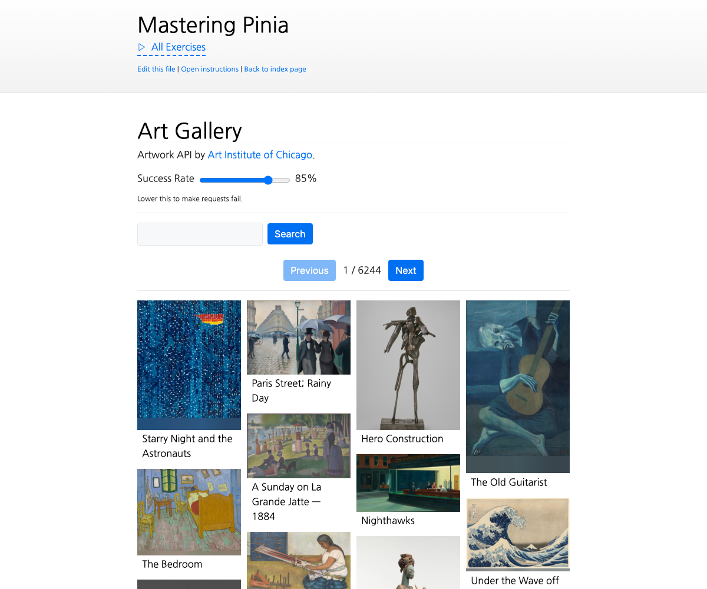

# Retrying failed actions

<picture>
  <source srcset="./.internal/screenshot-dark.png" media="(prefers-color-scheme: dark)">
  
</picture>

In this exercise, we will implement a retrying mechanism for stores

## 📝 Your Notes

Write your notes or questions here.

## 🎯 Goals

- It should...

## 💪 Extra goals

_Extra goals might not have any tests and can be done later or skipped._

- do...
